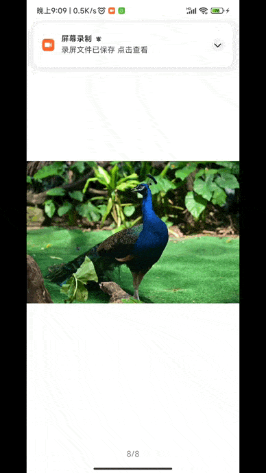
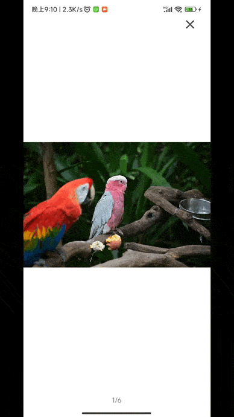
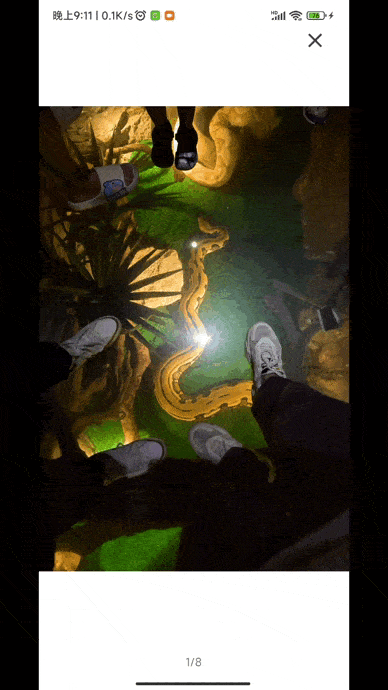
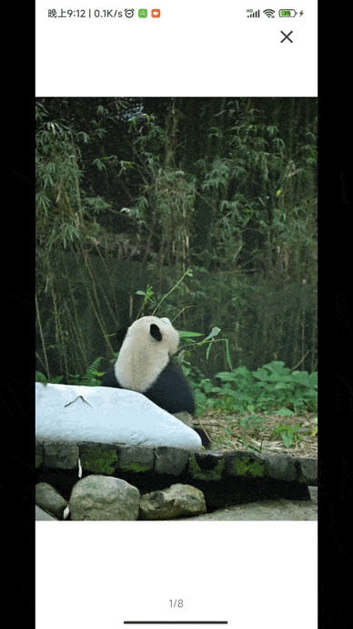
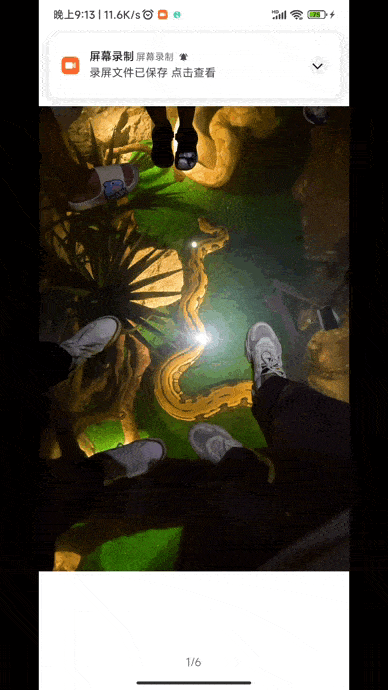
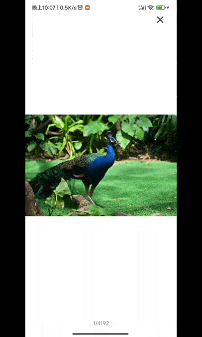

# WImagePreview
本项目是基于ViewPager2构建的一个Android图片预览组件\
[](https://jitpack.io/#Wei-1021/WImagePreview)\
仓库：\
[](https://github.com/Wei-1021/WImagePreview)
[](https://gitee.com/weizhanjie/WImagePreview)

# 如何导入
## 1.在项目根目录下的build.gradle添加
```
allprojects {
    repositories {
        ...
        maven { url 'https://jitpack.io' }
    }
}
```
## 2.引入依赖
```
dependencies {
    implementation 'com.github.Wei-1021:WImagePreview:v1.2.1'
}
```

# 使用方式
### 使用示例：
以下为使用示例，不代表所有功能
```
WImagePreviewBuilder
    .load(MainActivity.this)
    .setData(imageList)
    .setPosition(position)
    .setOnPageListener(new OnPageListener() {
        @Override
        public void onClick(Object o, int position) {
            super.onClick(o, position);
        }
    })
    .start();
```

# 功能
### 属性
| 方法                                                              | 是否必须     | 描述                                                                                                                                                                                                       |
|-----------------------------------------------------------------|----------|----------------------------------------------------------------------------------------------------------------------------------------------------------------------------------------------------------|
| load(Context context)<br/>load(Fragment fragment)               | <b>是</b> | 加载图片预览组件                                                                                                                                                                                                 |
| setData(List\<T\> imgList)                                      | <b>是</b> | 设置图片集合数据(目前仅支持Uri和String类型的)                                                                                                                                                                             |
| setPosition(int position)                                       | <b>是</b> | 设置图片下标定位                                                                                                                                                                                                 |
| start()                                                         | <b>是</b> | 启动组件                                                                                                                                                                                                     |
| setOrientation(int orientation)                                 | 否        | 设置滚动方向<br/>水平滚动：ViewPager2.ORIENTATION_HORIZONTAL（默认）；<br/>垂直滚动：ViewPager2.ORIENTATION_VERTICAL。                                                                                                         |
| setAllowMove(boolean isAllowImage)                              | 否        | 设置是否允许滑动，设置禁止滑动后，与之相关的三个监听方法（onPageScrolled、onPageSelected、onPageScrollStateChanged）将无法生效。<br/>true：允许（默认）；<br/>false：不允许                                                                                |
| setFullscreen(boolean isFullscreen)                             | 否        | 设置是否全屏<br/>true：全屏（默认）；<br/>false：非全屏                                                                                                                                                                    |
| setShowClose(boolean isShowClose)                               | 否        | 是否显示关闭按钮<br/>true：显示（默认）；<br/>false：不显示                                                                                                                                                                  |
| setPageMargin(int pageMargin)                                   | 否        | 设置ViewPager2页面间距（默认为10）<br/><b>setPageMargin()</b>和<b>setPageTransformer()</b>只能设置其中一个，如果两个都设置，则只有<b>setPageTransformer()</b>生效                                                                          |
| setPageTransformer(int pageTransformer)                         | 否        | 设置页面切换动画 <br/><b>setPageMargin()</b>和<b>setPageTransformer()</b>只能设置其中一个，如果两个都设置，则只有<b>setPageTransformer()</b>生效<br/>pageTransformer：动画类型;详见PageTransformer中的常量                                         |
| setPageTransformer(ViewPager2.PageTransformer pageTransformer)  | 否        | 设置页面切换动画 <br/><b>setPageMargin()</b>和<b>setPageTransformer()</b>只能设置其中一个，如果两个都设置，则只有<b>setPageTransformer()</b>生效<br/>pageTransformer：动画类型;详见PageTransformer 或者可以通过实现ViewPager2.PageTransformer接口进行自定义动画 |
| setOnPageListener(OnPageListener listener)                      | 否        | 设置监听器，对应下方监听方法                                                                                                                                                                                           |

### 动画：PageTransformer
#### 常量 
| 名称                          | 描述  | 效果演示                    |
|-----------------------------|-----|-------------------------|
| PAGE_TRANSFORM_ZOOM_OUT     | 景深  |  |
| PAGE_TRANSFORM_DEPTH        | 叠层  |  |
| PAGE_TRANSFORM_FLIP         | 翻转  |  |
| PAGE_TRANSFORM_PUSH         | 推压  |  |
| PAGE_TRANSFORM_ROTATE       | 旋转  |  |
| PAGE_TRANSFORM_SQUARE_BOX   | 方块  |  |
| PAGE_TRANSFORM_WIND_MILL    | 风车  |  |
| 无    | 无动画  |  |

##### 使用方式
```
WImagePreviewBuilder
    .load(MainActivity.this)
    .setData(imageList)
    .setPosition(position)
    .setPageTransformer(PageTransformer.PAGE_TRANSFORM_DEPTH)
    .start();
```

#### 动画类
| 动画类                    | 描述  |
|------------------------|-----|
| ZoomOutPageTransformer | 景深  | 
| DepthPageTransformer   | 叠层  | 
| FlipTransformer        | 翻转  |  
| PushTransformer        | 推压  |  
| RotationTransformer    | 旋转  |  
| SquareBoxTransformer   | 方块  |  
| WindMillTransformer    | 风车  |  

也可以通过实现ViewPager2.PageTransformer接口自定义动画。如
```
public class ZoomOutPageTransformer implements ViewPager2.PageTransformer {
    @Override
        public void transformPage(View view, float position) {
            ...
        }
}
```

##### 使用方式
```
WImagePreviewBuilder
    .load(MainActivity.this)
    .setData(imageList)
    .setPosition(position)
    // 内置的动画类可以通过new PageTransformer.ZoomOutPageTransformer()方式使用
    .setPageTransformer(new ZoomOutPageTransformer()) 
    .start();
```

### 监听方法：OnPageListener
| 方法                                                                               | 描述                                                                |
|----------------------------------------------------------------------------------|-------------------------------------------------------------------|
| onOpen(int position)                                                             | 页面打开事件监听<br/> position：打开页面时，显示的第一张图片的定位                          |
| onClick(Object o, int position)                                                  | 页面点击事件监听<br/>o：图片对象（Uri或String类型） <br/> position：点击页面时，所显示图片的定位   |
| onClose(Object o, int position)                                                  | 页面关闭事件监听<br/>o：图片对象（Uri或String类型） <br/> position：关闭页面时，所显示图片的定位   |
| onPageScrolled(int position, float positionOffset, @Px int positionOffsetPixels) | 页面滑动事件监听。请参照ViewPager2的onPageScrolled                             |
| onPageSelected(int position)                                                     | 页面选择事件监听，打开页面，切换图片时会触发。请参照ViewPager2的onPageSelected               |
| onPageScrollStateChanged(@ViewPager2.ScrollState int state)                      | 页面滑动状态更改事件监听。请参照ViewPager2的onPageScrollStateChanged               |

# 注意事项
本项目图片加载库依赖Glide，依赖版本为4.12.0，若要导入本组件，您项目中的Glide版本建议不要低于4.12.0，否则可能会因为版本冲突而出现问题。
